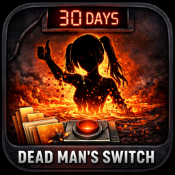
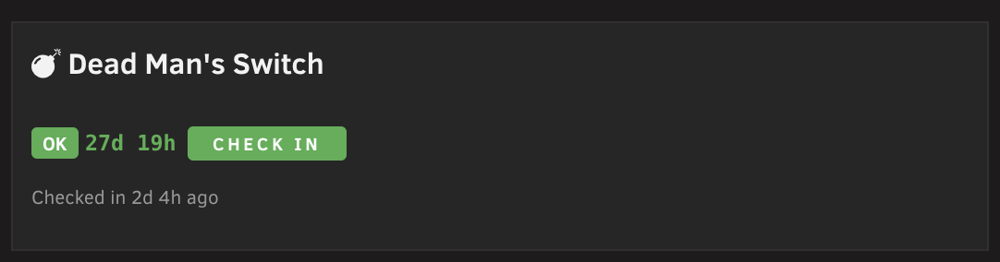
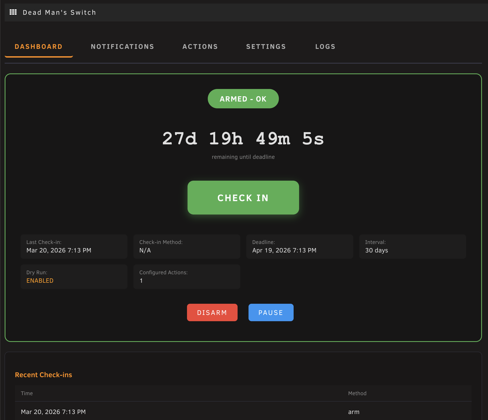
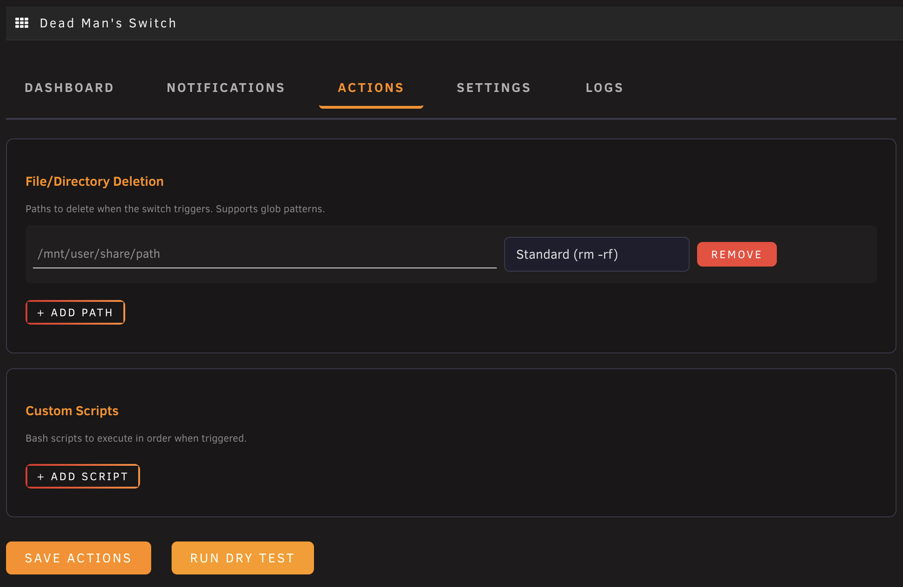
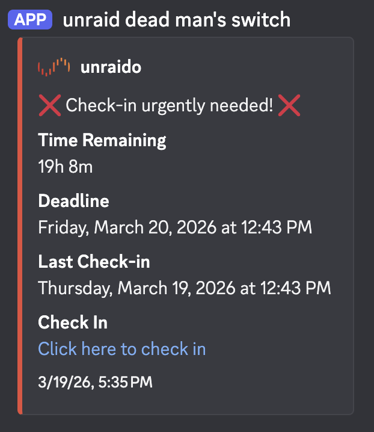
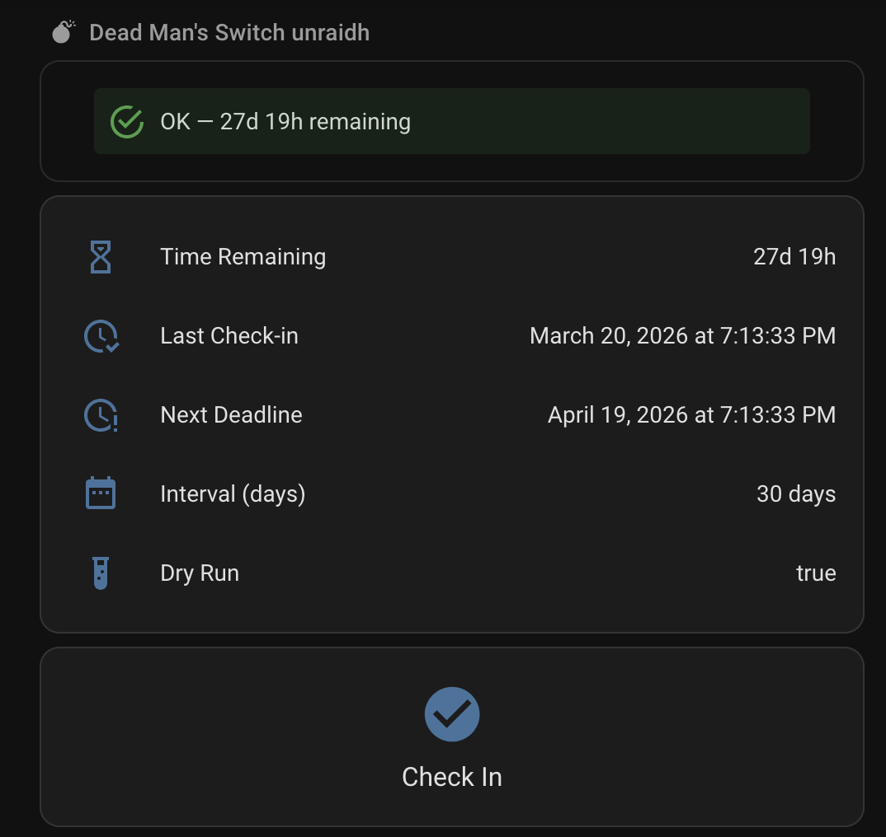
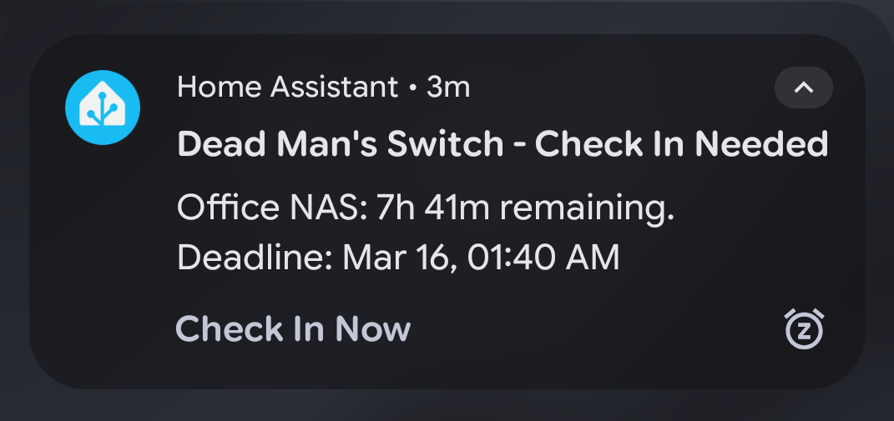

<p align="center">
  
</p>

# Dead Man's Switch for Unraid

A dead man's switch plugin for Unraid that requires periodic check-ins. If you stop checking in, it triggers configurable actions — like deleting files or running scripts — after a deadline passes.

Useful for privacy-conscious users who want automated cleanup if they become unable to manage their server.

## Screenshots

### Unraid Dashboard Tile


### Plugin Dashboard


### Actions Configuration


### Discord Notifications


## Features

- **Configurable check-in interval** — set how many days between required check-ins (default: 30)
- **Grace period** — extra hours after the deadline before actions trigger
- **Trigger actions** — delete files/folders (with glob pattern support) or run custom bash scripts
- **Dry run mode** — test your entire configuration safely before going live; run a dry test from the Actions tab to see exactly what would happen without actually deleting anything
- **Arm / Disarm / Pause controls** — full lifecycle management
- **Double-miss protection** — optionally require two consecutive missed deadlines before triggering
- **Dashboard tile** — real-time countdown on the Unraid dashboard

### Notifications

- **Discord webhooks** — rich embeds with severity-matched colors and one-click check-in links
- **Custom webhooks** — send notifications to any HTTP endpoint with configurable method and body template
- **Uptime Kuma** — push heartbeat monitoring so you can track check-in health externally
- **Warning thresholds** — configurable alerts at 50%, 75%, 90%, and 95% of elapsed time

### External API

- Runs on **port 3801**, separate from Unraid's authenticated nginx
- API key protected endpoints for remote check-ins and status queries
- Token-based quick check-in URLs (included in Discord notifications)
- CORS enabled for Home Assistant and browser clients

## Installation

In the Unraid web UI, go to **Plugins > Install Plugin** and paste:

```
https://raw.githubusercontent.com/dereckhall/unraid-deadmans-switch/main/plugin/deadman-switch.plg
```

Requires **Unraid 6.12.0** or later.

## Configuration

After installation, go to **Settings > Dead Man's Switch**. The UI has five tabs:

| Tab | Description |
|-----|-------------|
| **Dashboard** | Live countdown, check-in button, arm/disarm/pause controls |
| **Notifications** | Discord webhooks, custom webhooks, Uptime Kuma push URL, warning thresholds |
| **Actions** | File/folder deletions (glob patterns supported) and custom script executions, with dry run testing |
| **Settings** | Check-in interval, grace period, cron frequency, dry run toggle, API key management |
| **Logs** | Recent activity and check-in history |

## API Reference

The plugin runs a lightweight API server on **port 3801** for remote access without Unraid authentication.

| Endpoint | Auth | Description |
|----------|------|-------------|
| `?action=health` | None | Health check, returns version |
| `?action=status&key=KEY` | API key | Current switch status and countdown |
| `?action=checkin&key=KEY` | API key | Perform a check-in |
| `?action=get_state&key=KEY` | API key | Full state JSON |
| `?action=quickcheckin&token=TOKEN` | Token | One-click check-in (for notification links) |

```bash
# Check status
curl "http://YOUR_UNRAID_IP:3801/?action=status&key=YOUR_API_KEY"

# Perform a check-in
curl "http://YOUR_UNRAID_IP:3801/?action=checkin&key=YOUR_API_KEY"
```

## Home Assistant Integration

The external API makes it easy to integrate with Home Assistant using REST sensors, automations, and actionable notifications.

<p float="left">
  
  
</p>

<details>
<summary>Example REST sensor + check-in command</summary>

Add to `configuration.yaml`, then restart Home Assistant (or reload YAML configuration):

```yaml
rest:
  - resource: "http://YOUR_UNRAID_IP:3801/?action=status&key=YOUR_API_KEY"
    scan_interval: 300
    sensor:
      - name: "Dead Man's Switch"
        value_template: "{{ value_json.status }}"
        json_attributes:
          - armed
          - warning_level
          - days_remaining
          - time_remaining_display
          - last_checkin
          - next_deadline

rest_command:
  dms_checkin:
    url: "http://YOUR_UNRAID_IP:3801/?action=checkin&key=YOUR_API_KEY"
    method: GET
```

</details>

### Check-in button

The `rest_command` above powers a one-tap check-in from a Lovelace card. Add this card via **Dashboard → Edit → Add Card → Manual**:

```yaml
type: entities
title: Dead Man's Switch
entities:
  - entity: sensor.dead_man_s_switch
    name: Status
  - type: attribute
    entity: sensor.dead_man_s_switch
    attribute: time_remaining_display
    name: Time remaining
  - type: attribute
    entity: sensor.dead_man_s_switch
    attribute: last_checkin
    name: Last check-in
footer:
  type: buttons
  entities:
    - entity: sensor.dead_man_s_switch
      name: CHECK IN NOW
      tap_action:
        action: call-service
        service: rest_command.dms_checkin
```

Tapping **CHECK IN NOW** calls the check-in endpoint and resets your timer. The sensor refreshes on its next poll (every 5 minutes above); lower `scan_interval` for a faster update after checking in. You can fire the same `rest_command.dms_checkin` from an automation or an actionable mobile notification to get a check-in button right on your phone.

## How It Works

1. **Arm** the switch and perform your first check-in
2. A cron job runs periodically (default: every 60 minutes) to evaluate the countdown
3. As the deadline approaches, notifications fire at configurable warning thresholds
4. If you check in before the deadline, the timer resets
5. If the deadline passes (plus grace period), configured trigger actions execute
6. The API server self-heals — if the process dies, the cron job restarts it

## Troubleshooting

### API server not running

The external API server on port 3801 should auto-start on install and self-heal via the cron job. If it's not running:

```bash
# Check if the process is alive
ps aux | grep "external-api.php" | grep -v grep

# Manually start it
/usr/local/emhttp/plugins/deadman-switch/scripts/start-api.sh

# Check for port conflicts
lsof -i :3801
```

### Cron job not firing

The plugin installs a cron file at `/boot/config/plugins/deadman-switch/deadman-switch.cron`. If notifications or countdown checks aren't happening:

```bash
# Verify the cron file exists and has content
cat /boot/config/plugins/deadman-switch/deadman-switch.cron

# Rebuild cron from the plugin's cron file
/usr/local/sbin/update_cron
```

### Discord notifications not sending

1. Verify your webhook URL is correct in the Notifications tab
2. Use the **Test** button in the UI to send a test notification
3. Check the Logs tab for any error messages
4. Ensure your Unraid server has outbound internet access

### Actions not triggering (or triggering unexpectedly)

- Make sure **Dry Run** mode is off in the Settings tab if you want real execution
- Use the **Dry Test** button on the Actions tab to preview what would happen
- Glob patterns (`*`) do not match dotfiles/dotfolders — this is intentional for safety
- Check the Logs tab for trigger execution details

### Quick check-in link not working

The one-click check-in URL in Discord notifications uses port 3801 and requires direct network access to your Unraid server. It won't work through reverse proxies that don't forward port 3801. Ensure the link IP/hostname is reachable from where you're clicking it.

### Plugin not updating

GitHub CDN can cache the PLG file. To force a fresh install:

```bash
curl -H 'Cache-Control: no-cache' -o /tmp/deadman-switch.plg \
  https://raw.githubusercontent.com/dereckhall/unraid-deadmans-switch/main/plugin/deadman-switch.plg
plugin install /tmp/deadman-switch.plg
```

## License

MIT License — see [LICENSE](LICENSE) for details.
